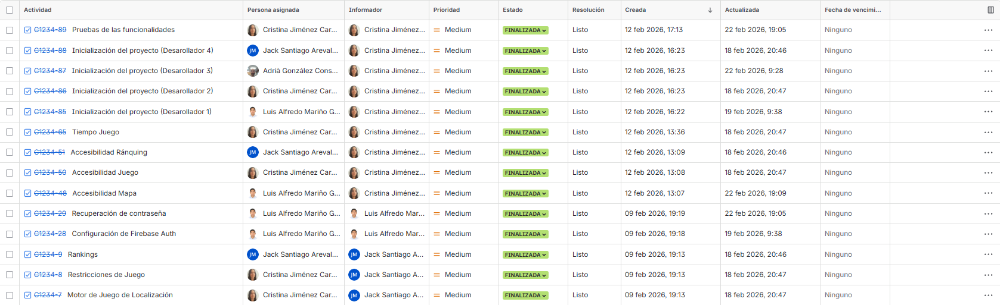
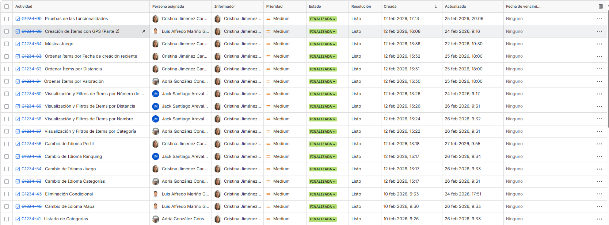
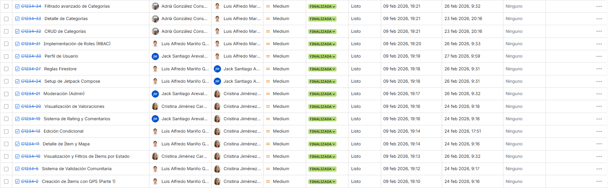
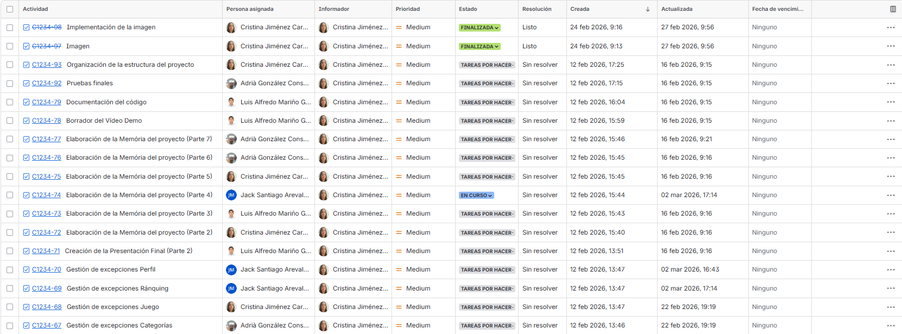
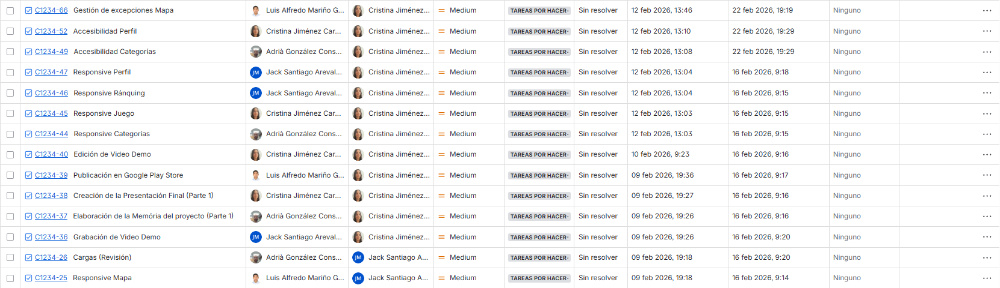

# Memoria del proyecto: AguaMap

## Aplicación móvil para la localización de puntos de agua potable

---

**Equipo de desarrollo**

- Jack Santiago Arévalo Montesinos
- Luis Alfredo Mariño
- Adrià González Consuegra
- Cristina Jiménez Cardoso

---

**Fecha de entrega: 11/03/2026**

---

## Índice

**1. INTRODUCCIÓN**

    1.1 Objetivos de la aplicación

    1.2 Target (Público objetivo)

**2. DOCUMENTACIÓN TÉCNICA**

    2.1 Requisitos funcionales por roles

    2.2 Diseño de la base de datos NoSQL (Firestore)

    2.3 Reglas de Firebase

    2.4 Otras tecnologías utilizadas

**3. PLANIFICACIÓN Y SEGUIMIENTO DE LAS TAREAS DE DESARROLLO**

    3.1 SPRINT 1

        3.1.1 Planificación inicial

        3.1.2 Release notes

    3.2 SPRINT 2

         3.2.1 Planificación inicial

         3.2.2 Release notes

    3.3 SPRINT 3

         3.3.1 Planificación inicial

         3.3.2 Release notes

**4. CODIFICACIÓN**

    4.1 Control de versiones

**5. RECURSOS DEL PROYECTO**

    5.1 Demo de la aplicación

    5.2 Portafolios

**6. LÍNEAS FUTURAS**

    6.1 Notificaciones

    6.2 Juego y recompensas

    6.3 Comunidad y comunicación

    6.4 Uso sin Internet

    6.5 Accesibilidad e idiomas

    6.6 Navegación y rutas

    6.7 Impacto ambiental

**7. CONCLUSIÓN**

---

## 1. INTRODUCCIÓN

En este apartado se presentará la aplicación AguaMap. Se expondrán los objetivos del proyecto, su contribución a los Objetivos de Desarrollo Sostenible (ODS) y el perfil de los usuarios a los que va dirigida.

### 1.1 Objetivos de la aplicación

**AguaMap** es una aplicación móvil que permitirá localizar puntos de acceso de agua potable en cualquier ciudad. Su objetivo principal es facilitar el acceso al agua de calidad, fomentar hábitos saludables y reducir el impacto ambiental asociado al consumo de agua embotellada. La app se alinea directamente con los siguientes **[Objetivos de Desarrollo Sostenible (ODS) de la Agenda 2030](https://sdgs.un.org/2030agenda)**:

-   **ODS 6: “Agua limpia y saneamiento”**
    -   **Problema:** Muchas personas desconocen dónde se encuentran las fuentes públicas y puntos de agua potable. Esta falta de información dificulta el acceso al agua y fomenta el consumo de agua embotellada.
    -   **Solución:** AguaMap reunirá en una sola aplicación todos los puntos de agua potable y los mostrará de forma geolocalizada. Esto facilitará el acceso al agua, ayudará a utilizar mejor este recurso y reforzará su uso como alternativa pública y sostenible.

-   **ODS 3: “Salud y bienestar”**
    -   **Problema:** En el día a día no siempre los ciudadanos consumen suficiente agua, sobre todo durante desplazamientos o actividades al aire libre, lo que afecta al bienestar general.
    -   **Solución:** La aplicación permitirá encontrar puntos de agua cercanos, animando a consumir agua con más frecuencia y a mantener hábitos más saludables. Además, fomentará el caminar o el desplazamiento con vehículos sin motor.

-   **ODS 11: “Ciudades y comunidades sostenibles”**
    -   **Problema:** Los servicios públicos no siempre son visibles ni fáciles de localizar, lo que dificulta su uso y reduce la accesibilidad en la ciudad.
    -   **Solución:** AguaMap hará visibles las infraestructuras de agua potable existentes, ayudando a crear una ciudad más accesible, práctica y sostenible.

-   **ODS 12: “Producción y consumo responsables”**
    -   **Problema:** El uso de botellas de plástico de un solo uso sigue siendo muy alto, en gran parte porque no se conocen alternativas cercanas.
    -   **Solución:** Al facilitar el acceso al agua potable, AguaMap promoverá la reutilización de botellas y reducirá el consumo de plástico, fomentando hábitos de consumo más responsables.

-   **ODS 13: “Acción para el clima”**
    -   **Problema:** La producción y el transporte de agua embotellada generan emisiones de CO₂, lo que conlleva un impacto negativo en el medio ambiente.
    -   **Solución:** AguaMap ayudará a disminuir la huella de carbono asociada al consumo de agua embotellada al apostar por recursos locales.

Actualmente existen algunas aplicaciones similares que permiten localizar puntos de agua potable o lugares donde rellenar botellas, como [Refill](https://therefillconcept.com/?srsltid=AfmBOopCp_0Yq3Obu2XMOD3i3oDVsGbVNCBLdHlw0I3Ew44qGBBRlZ1H) o  [Tap](https://tappwater.co/es?tw_source=google&tw_adid=&tw_campaign=20963692788&tw_kwdid=&gad_source=1&gad_campaignid=20963699724&gbraid=0AAAAADRhM_U_AhlGJCXpRjG8Md7WfXwl-&gclid=CjwKCAiAtq_NBhA_EiwA78nNWNhx6kDnV5-uEpOxHK6-UJqGq1WnFKodpSZXlVXSrbgG9R6ofYEDHRoCcx4QAvD_BwE). Estas aplicaciones funcionan en diferentes ciudades del mundo y utilizan mapas para mostrar puntos de recarga de agua. Sin embargo, muchas de ellas dependen principalmente de establecimientos privados o tienen una cobertura limitada en determinadas zonas.

En este contexto, AguaMap pretende diferenciarse ofreciendo una plataforma centrada en la localización de fuentes públicas de agua potable, con información clara, accesible y adaptada al entorno urbano. Además, la aplicación permitirá que los propios usuarios puedan contribuir a mantener actualizada la información sobre los puntos de agua, favoreciendo así una base de datos más completa y colaborativa.

### 1.2 Target (Público objetivo)

La aplicación está dirigida a toda la ciudadanía y visitantes que busquen hidratarse de forma gratuita y sostenible, reduciendo el uso de plásticos y fomentando hábitos de vida saludables. Esto incluye desde deportistas, excursionistas y ciclistas, hasta cualquier persona que se desplace por la ciudad.

## 2. DOCUMENTACIÓN TÉCNICA

En este apartado se detallarán los requisitos funcionales de la aplicación, diferenciando entre usuarios y administradores. También se describirá la estructura de la base de datos NoSQL en Firestore y las reglas de seguridad implementadas.

### 2.1 Requisitos funcionales por roles

| ID     | Requisito                                                                                               | Usuario | Administrador |
| :----- |:--------------------------------------------------------------------------------------------------------| :-----: | :-----------: |
| RF01   | Iniciar sesión con correo y contraseña.                                                                 |    ✓    |       ✓       |
| RF02   | Registrarse en la aplicación.                                                                           |    ✓    |       ✓       |
| RF03   | Recuperar contraseña mediante correo electrónico.                                                       |    ✓    |       ✓       |
| RF04   | Crear una nueva categoría (nombre, imagen, descripción).                                                |         |       ✓       |
| RF05   | Listar todas las categorías.                                                                            |    ✓    |       ✓       |
| RF06   | Filtrar categorías por nombre y estado (usando comodines * y ?).                                        |    ✓    |       ✓       |
| RF07   | Ampliar información de una categoría (nombre, imagen, descripción).                                     |    ✓    |       ✓       |
| RF08   | Modificar una categoría (nombre, imagen, descripción).                                                  |         |       ✓       |
| RF09   | Eliminar una categoría (si no tiene ítems asociados).                                                   |         |       ✓       |
| RF10   | Crear un nuevo ítem (fuente) con imagen, título, descripción, fecha, autor y GPS (manual o automático). |    ✓    |       ✓       |
| RF11   | Listar todos los ítems (imagen, título, botón de ampliar).                                              |    ✓    |       ✓       |
| RF12   | Filtrar ítems por categoría o estado.                                                                   |    ✓    |       ✓       |
| RF13   | Filtrar ítems por nombre.                                                                               |    ✓    |       ✓       |
| RF14   | Filtrar ítems por rango de distancia (mínima y máxima).                                                 |    ✓    |       ✓       |
| RF15   | Filtrar ítems por número de estrellas de valoración.                                                    |    ✓    |       ✓       |
| RF16   | Ordenar ítems por mejor/peor valoración global.                                                         |    ✓    |       ✓       |
| RF17   | Ordenar ítems por distancia (de menor a mayor o viceversa).                                             |    ✓    |       ✓       |
| RF18   | Ordenar ítems por fecha de creación (más reciente a más antiguo).                                       |    ✓    |       ✓       |
| RF19   | Ampliar información de un ítem (título, imagen, descripción, autor, fecha, mapa, distancia).            |    ✓    |       ✓       |
| RF20   | Crear una valoración (1-5 estrellas) con comentario opcional para un ítem.                              |    ✓    |       ✓       |
| RF21   | Visualizar la valoración global y las valoraciones individuales de un ítem.                             |    ✓    |       ✓       |
| RF22   | Modificar un ítem (con restricciones según validación y rol).                                           |    ✓*   |       ✓       |
| RF23   | Eliminar un ítem (manual por admin, automático por reportes).                                           |         |       ✓       |
| RF24   | Eliminar una valoración y su comentario asociado.                                                       |         |       ✓       |
| RF25   | Censurar un comentario (eliminarlo, pero no la valoración).                                             |         |       ✓       |
| RF26   | Iniciar una partida en "AguaQuest" (juego de geolocalización).                                          |    ✓    |       ✓       |
| RF27   | Visualizar el Top 10 de puntuaciones del día.                                                           |    ✓    |       ✓       |
| RF28   | Visualizar el Top 10 de puntuaciones del mes.                                                           |    ✓    |       ✓       |
| RF29   | Visualizar el Top 10 de puntuaciones del año.                                                           |    ✓    |       ✓       |
| RF30   | Gestionar el perfil propio (datos, fuentes, valoraciones, historial, idioma).                           |    ✓    |       ✓       |
| RF31   | Tener un apartado de gestión para la aplicación.                                                        |         |       ✓       |

*\*Los usuarios pueden modificar sus ítems no validados. Si el ítem está validado, sus modificaciones se convierten en sugerencias.*

### 2.2 Diseño de la base de datos NoSQL (Firestore)

A continuación, se propone la estructura de colecciones y documentos realizada en Firestore.

### Colecciónes y documentos

### **Colección `categories`**
*Documento `{categoryId}`*

    {
      "id": "string",
      "name": "string",
      "imageUrl": "string",
      "description": "string"
    }

### **Colección `fountains`**
*Documento `{fountainId}`*

    {
      "id": "string",
      "name": "string",
      "latitude": "number",
      "longitude": "number",
      "geohash": "string",
      "operational": "boolean",
      "category": {
        "id": "string",
        "name": "string",
        "imageUrl": "string",
        "description": "string"
      },
      "votedByPositive": ["string"],
      "votedByNegative": ["string"],
      "description": "string",
      "imageUrl": "string",
      "dateCreated": "timestamp",
      "ratingAverage": "number",
      "totalRatings": "number",
      "status": "string",
      "createdBy": "string",
      "positiveVotes": "number",
      "negativeVotes": "number"
    }

### **Subcolección `comments` dentro de `fountains`**
*Documento `{commentId}` dentro de `/fountains/{fountainId}/comments/`*

    {
      "id": "string",
      "userId": "string",
      "userName": "string",
      "rating": "number",
      "comment": "string",
      "censored": "boolean",
      "reported": "boolean",
      "timestamp": "number"
    }

### **Colección `gameSessions`**
*Documento `{gameSessionId}`*

    {
      "userId": "string",
      "userName": "string",
      "score": "number",
      "distance": "number",
      "date": "timestamp",
      "fountainId": "string",
      "fountainName": "string"
    }

### **Colección `reports`**
*Documento `{reportId}`*

    {
      "id": "string",
      "fountainId": "string",
      "fountainName": "string",
      "userId": "string",
      "description": "string",
      "timestamp": "number",
      "resolved": "boolean"
    }

### **Colección `reportedComments`**
*Documento `{reportedCommentsId}`*

    {
    "reportId": "string",
    "fountainId": "string",
    "commentId": "string",
    "reason": "string",
    "timestamp": "number"
    }

### **Colección `users`**
*Documento `{userId}`*

    {
    "uid": "string",
    "nom": "string",
    "email": "string",
    "role": "string" // "USER" o "ADMIN"
    }

### **Colección `user_stats`**
*Documento `{userId}`*

    {
    "userId": "string",
    "userName": "string",
    "fountainsCount": "number",
    "commentsCount": "number",
    "lastUpdated": "timestamp"
    }

### 2.3 Reglas del Firebase
    rules_version = '2';

    service cloud.firestore {
        match /databases/{database}/documents {
        
            // --- FUNCIONES DE AYUDA ---
            function isAuthenticated() {
              return request.auth != null;
            }
        
            // Verifica si el documento del usuario actual tiene el campo role como 'ADMIN'
            function isAdmin() {
              return isAuthenticated() &&
                     get(/databases/$(database)/documents/users/$(request.auth.uid)).data.role == 'ADMIN';
            }
        
            // --- REGLAS DE DESARROLLO ---
            // Permite lectura y escritura general a usuarios autenticados temporalmente
            match /{document=**} {
              allow read, write: if isAuthenticated();
            }
        
            // 1. CATEGORÍAS
            match /categories/{categoryId} {
              allow read: if true;
              allow write: if isAdmin();
            }
        
            // 2. FUENTES (FOUNTAINS)
            match /fountains/{fountainId} {
              allow read: if true;
              allow create, update, delete: if isAuthenticated();
        
              match /comments/{commentId} {
                allow read: if true;
                allow create, update, delete: if isAuthenticated();
              }
            }
        
            // 3. USUARIOS
            match /users/{userId} {
              // Un usuario solo puede leer/escribir su propio documento, o si es ADMIN
              allow read, write: if isAuthenticated() && (request.auth.uid == userId || isAdmin());
            }
        
            // 4. JUEGO Y RANKINGS
            match /gameSessions/{doc} { allow read, write: if isAuthenticated(); }
            match /monthlyRanking/{doc} { allow read, write: if isAuthenticated(); }
            match /historicRanking/{doc} { allow read, write: if isAuthenticated(); }
            match /userStats/{doc} { allow read, write: if isAuthenticated(); }
        
            // 5. REPORTES
            match /reports_comments/{reportId} {
              allow read, write: if isAuthenticated();
            }
        
            match /reports/{reportId} {
              allow read, write: if isAuthenticated();
            }
        }
    }

### 2.4 Otras tecnologías utilizadas

Para complementar el desarrollo de **AguaMap**, se han incorporado diversas herramientas y servicios tecnológicos que facilitan la programación, el almacenamiento de recursos y el diseño de la interfaz de usuario:

- **Android Studio**: Entorno de desarrollo integrado utilizado para la creación de la aplicación.

- **Kotlin**: Lenguaje de programación elegido por su compatibilidad con Android y sus características modernas, como la seguridad de tipos y la concisión del código.

- **Cloudinary**: Servicio en la nube para la gestión y optimización de imágenes asociadas a los puntos de agua y las fotos de perfiles de los usuarios.

- **Jetpack Compose**: Librería para el diseño de interfaces de usuario de manera declarativa, moderna y eficiente.

## 3. PLANIFICACIÓN Y SEGUIMIENTO DE LOS TAREAS DE DESARROLLO

En este apartado se explicará la organización del trabajo mediante sprints realizado en el Jira. Se presentarán los objetivos iniciales planificados para cada fase y las notas de lanzamiento, junto con los enlaces al control de versiones y a los materiales finales del proyecto.

Para garantizar un desarrollo ordenado y eficiente de AguaMap, se ha trabajado siguiendo una metodología ágil basada en **sprints**. Cada sprint ha tenido una duración definida con objetivos claros, permitiendo entregar funcionalidades completas y funcionales al final de cada ciclo.

### 3.1 SPRINT 1

### 3.1.1 Planificación inicial
En este primer sprint se establecieron las bases técnicas del proyecto y se definieron las funcionalidades principales:

- **Infraestructura:** Configuración inicial de Firebase como soporte técnico del proyecto.

- **Autenticación:** Creación del sistema de registro y acceso de usuarios.

- **Localización:** Desarrollo de la geolocalización básica para las fuentes de agua.

- **Gamificación:** Implementación de las mecánicas principales de juego de la aplicación.

  

*Figura: Tareas realizadas en el Jira durante el Sprint 1.*

### 3.1.2 Release notes
- **Funcionalidad básica:** Sistema de autenticación seguro integrado con Firebase y base del mapa interactivo.

- **Juego:** Motor de juego con geolocalización, cálculo de distancias y sistema de rankings.

- **Idiomas:** Interfaz multilingüe en tres idiomas (catalán, castellano e inglés).

### 3.2 SPRINT 2

### 3.2.1 Planificación inicial  
En el segundo sprint se añadieron funcionalidades avanzadas y se desarrolló el panel de administración:

- **Categorías:** Implementación del sistema de clasificación y etiquetas de las fuentes.

- **Fuentes:** Gestión avanzada de las fuentes de agua con geolocalización en Firestore.

- **Administración:** Desarrollo del panel de control para gestionar la aplicación.

- **Seguridad:** Configuración de roles de usuario y reglas de acceso a los datos.

  
  

*Figura: Tareas realizadas en el Jira durante el Sprint 2.*

### 3.2.2 Release notes
- **Funcionalidades:** Gestión de fuentes por GPS e integración de mapas interactivos.

- **Comunidad:** Sistema de validación de información mediante comentarios y filtros de búsqueda.

- **Control:** Panel de moderación para administradores y gestión de contenido.

### 3.3 SPRINT 3

### 3.3.1 Planificación inicial 
En el tercer sprint se enfocó en la optimización, la documentación final y la preparación de la presentación:

- **Estabilidad:** Gestión de errores y excepciones en todos los módulos de la aplicación.

- **Interfaz:** Mejoras en el diseño adaptable (responsive) y la accesibilidad.

- **Documentación:** Elaboración de la memoria técnica y documentación final del proyecto.

- **Promoción:** Creación del vídeo demo y preparación de la presentación final.

  
  

*Figura: Tareas realizadas en el Jira durante el Sprint 3.*

### 3.3.2 Release notes
- **Estabilidad y rendimiento:** Corrección de errores y optimización general de la aplicación.

- **Usabilidad:** Mejoras en la experiencia del usuario y la accesibilidad.

- **Entrega final:** Documentación completa, demo de la aplicación y material para la presentación.

## 4. CODIFICACIÓN

En este apartado se facilitará el enlace al repositorio en GitHub donde se ha alojado el código fuente del proyecto, permitiendo consultar el historial de versiones y la colaboración entre los desarrolladores.

### 4.1 Control de versiones
- Repositorio en GitHub: [enlace](https://github.com/locojack555/Aguamap)

## 5. Recursos del proyecto

En este apartado se recopilarán los materiales complementarios, incluyendo un vídeo demostrativo de la aplicación en funcionamiento y los portafolios profesionales de los miembros del equipo de desarrollo.

### 5.1 Demo de la aplicación

- Vídeo: [enlace](https://drive.google.com/file/d/1ZK3Q-GuLDarfJJrBha7spoPw1VquN-xH/view?usp=sharing)

### 5.2 Portafolio

- Desarollador 1 (Jack Santiago Arévalo Montesinos): [enlace](https://github.com/locojack555/Aguamap)

- Desarollador 2 (Luis Alfredo Mariño): [enlace](https://github.com/lamarinog/AguaMap)

- Desarollador 3 (Cristina Jiménez Cardoso): [enlace](https://github.com/CristinaJimenez2006/AguaMap)

- Desarollador 4 (Adrià González Consuegra): [enlace](https://github.com/Deleuze58/AguaMap.git)

## 6. LÍNEAS FUTURAS

En este apartado se plantearán las posibles mejoras y nuevas funcionalidades que podrían incorporarse en versiones posteriores en AguaMap, con el objetivo de seguir evolucionando el proyecto.

### 6.1. Notificaciones

La aplicación enviará avisos automáticos que permitirán a los usuarios actuar según la situación:

- Fuentes de agua cercanas.
- Cambios en el estado de las fuentes (si funcionan o están en mantenimiento).
- Recordatorios para beber agua.

Estos avisos ayudarán a los usuarios a organizar sus recorridos y actividades de forma más práctica.

### 6.2. Juego y recompensas

Se incorporarán elementos de juego que motiven a los usuarios a interactuar con la aplicación:

- Puntos o logros por acciones como reportar o valorar fuentes.
- Niveles al completar tareas.
- Insignias al completar rutas.

Esto fomentará que los usuarios exploren más y usen la aplicación de forma continuada.

### 6.3. Comunidad y comunicación

Se habilitarán herramientas de comunicación para que los usuarios compartan información y experiencias:

- Chats individuales y grupales sobre fuentes o rutas.
- Foros para intercambiar información y experiencias.
- Seguir a otros usuarios y ver sus actividades.

Estas funciones permitirán construir una comunidad activa y colaborativa dentro de la aplicación.

### 6.4. Uso sin Internet

La aplicación podrá usarse sin conexión, garantizando acceso a funciones esenciales:

- Consultar el mapa con las fuentes guardadas.
- Ver información de cada fuente (descripción y estado).
- Guardar valoraciones, comentarios y rutas, que se sincronizarán al reconectarse.

Esto hará que la aplicación sea útil en zonas con poca cobertura o durante actividades al aire libre.

### 6.5. Accesibilidad e idiomas

Se adaptará la aplicación para que todos los usuarios puedan utilizarla de manera cómoda e inclusiva:

- Lectores de pantalla y navegación por voz.
- Modos de alto contraste y ajuste de tamaño de letra.
- Traducción a varios idiomas, incluyendo locales y los más hablados.

Esto permitirá un uso accesible y global de la aplicación.

### 6.6. Navegación y rutas

Se mejorará la guía hacia las fuentes de agua mediante funciones que faciliten el desplazamiento:

- Indicaciones paso a paso en mapas interactivos.
- Rutas seguras para caminar, en bici u otros medios.
- Mapa con concentración de usuarios.

Esto permitirá que los usuarios lleguen a las fuentes de forma segura y eficiente.

### 6.7. Impacto ambiental

Se mostrarán datos sobre cómo el uso de la aplicación contribuye al cuidado del medio ambiente:

- Cantidad de botellas reutilizables usadas.
- Estimación de reducción de emisiones de CO₂.
- Datos por ciudad y por usuario.
- Gráficos del ahorro de plástico y reducción de emisiones con el tiempo.

Esto fomentará hábitos sostenibles y aumentará la conciencia ambiental de los usuarios.

# 7. CONCLUSIÓN

El desarrollo del proyecto **AguaMap** ha permitido diseñar e implementar una aplicación móvil orientada a facilitar la localización de puntos de agua potable en entornos urbanos. El objetivo principal del proyecto ha sido mejorar la accesibilidad a este recurso mediante el uso de tecnologías de geolocalización, promoviendo al mismo tiempo hábitos de consumo más saludables y sostenibles.

A lo largo del desarrollo del proyecto se han aplicado diferentes conocimientos relacionados con el desarrollo de aplicaciones móviles, la gestión de bases de datos NoSQL y el uso de servicios en la nube. La aplicación ha sido desarrollada utilizando **Android Studio** como entorno de desarrollo y el lenguaje de programación **Kotlin**. Además, se han empleado herramientas como **Firebase** para la gestión de datos y la autenticación de usuarios, **Cloudinary** para el almacenamiento y gestión de las imágenes asociadas a las fuentes de agua, y **Jetpack Compose** para el diseño de la interfaz de usuario. Asimismo, el uso de control de versiones mediante **GitHub** ha facilitado la organización del trabajo y la colaboración entre los distintos miembros del equipo.

La aplicación desarrollada permite a los usuarios localizar fuentes de agua potable cercanas, consultar información sobre cada punto y participar mediante valoraciones y comentarios. Asimismo, se ha incorporado un componente de gamificación a través del minijuego **AguaQuest**, con el objetivo de fomentar la participación de los usuarios y hacer más dinámica la experiencia dentro de la aplicación.

Desde una perspectiva social y ambiental, AguaMap contribuye a dar mayor visibilidad a las infraestructuras públicas de agua potable y a fomentar el uso de botellas reutilizables, reduciendo así el consumo de plásticos de un solo uso. En este sentido, el proyecto se alinea con los principios de sostenibilidad promovidos por **Naciones Unidas** dentro de la **Agenda 2030 para el Desarrollo Sostenible**.

En conclusión, AguaMap representa una propuesta tecnológica orientada a mejorar el acceso a servicios públicos y a promover hábitos más sostenibles en la vida cotidiana. Asimismo, el proyecto establece una base sólida para futuras mejoras y ampliaciones que permitan seguir desarrollando la aplicación y aumentar su impacto en la sociedad.

---